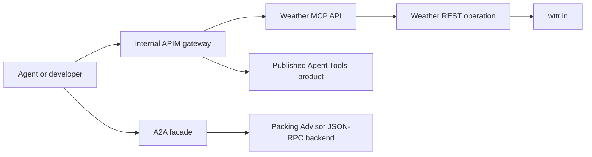

# Chapter 02a - Publish MCP Tools and A2A Agents through APIM

## Objective

This chapter turns the private API Management gateway from Chapter 02 into a small, consumable agent catalog. You will deploy:

- A city weather REST API backed by `wttr.in`
- A streamable HTTP MCP server generated from the weather operation
- A simple Packing Advisor that implements an A2A agent card and JSON-RPC `message/send`
- A published APIM product named **Agent Tools**
- Rate limits at the MCP and A2A boundaries

The weather service is intentionally simple and requires no API key. Replace it with an approved enterprise weather provider before production use.

## Architecture



The sample Packing Advisor is deterministic: send a destination as text and it returns a basic checklist. Its purpose is to demonstrate A2A discovery, mediation, governance, and publication without introducing an LLM dependency.

## Prerequisites

- Chapters 01 and 02 completed
- APIM provisioning state is `Succeeded`
- Access to a VM in `agent-blueprint-dev-vnet` or the peered `demovnet`
- Private DNS resolution for `*.azure-api.net` from that VM
- Azure CLI signed into the expected tenant and subscription

## Deploy

Preview first:

```powershell
cd infra/chapter-02a-mcp-a2a
./deploy.ps1
```

Deploy after reviewing the what-if output:

```powershell
./deploy.ps1 -Execute
```

The template uses the APIM `2025-09-01-preview` control-plane API because MCP API and tool resources are represented there. The runtime MCP protocol remains the standard streamable HTTP protocol.

## What the deployment creates

| APIM item | Path | Purpose |
|---|---|---|
| City Weather API | `/weather/{city}` | Managed REST operation |
| City Weather MCP Server | `/mcp/weather/mcp` | MCP endpoint with `get-city-weather` tool |
| Packing Advisor backend | `/a2a/packing-advisor-backend` | A2A card and JSON-RPC runtime |
| Agent Tools product | N/A | Published catalog grouping |

The MCP tool references the managed REST operation by ARM ID. APIM performs MCP tool discovery and invocation while the REST API continues to own backend routing.

## Import the A2A Agent API

Microsoft's current supported A2A import workflow is in the Azure portal. The deployment creates the working backend and card so the import is short and repeatable.

1. From the peered VM, verify this card returns JSON:

   ```text
   https://apim-agent-blueprint-dev-a5jiq4re.azure-api.net/a2a/packing-advisor-backend/.well-known/agent-card.json
   ```

2. Open APIM `apim-agent-blueprint-dev-a5jiq4re` in Azure Portal.
3. Select **APIs** > **+ Add API** > **A2A Agent**.
4. Enter the agent card URL above and select **Next**.
5. Set **Display name** to `Packing Advisor A2A` and **Base path** to `agents/packing-advisor`.
6. Confirm that runtime URL and agent ID were inferred from the card.
7. Create the API, then associate it with the published **Agent Tools** product.
8. Keep subscription authentication disabled for this lab. For production, enable it or apply Entra JWT validation.

APIM exposes a governed agent card whose hostname points to APIM, selects JSON-RPC transport, and reflects APIM authentication requirements.

## Make the APIs visible

The Bicep deployment publishes the **Agent Tools** product and links the REST, MCP, and sample A2A backend APIs. Link the imported A2A facade to the same product. Publish the developer portal again after changing its content or navigation.

MCP servers are primarily discovered by MCP clients from their server URL. The developer portal and product provide human-facing ownership and access documentation.

## Validate

Follow [the test guide](../infra/chapter-02a-mcp-a2a/TEST.md). Successful validation proves:

1. REST traffic reaches the weather provider through APIM.
2. MCP clients discover and invoke `get-city-weather`.
3. The A2A card is discoverable.
4. JSON-RPC `message/send` returns a completed A2A task.
5. The imported A2A facade rewrites discovery through the governed APIM endpoint.

> **Consuming these from a Foundry agent?** A prompt agent that attaches the MCP and A2A tools must run
> on a **network-injected** Standard account (Chapter 01a) to reach the internal APIM, and the A2A tool
> requires three things that are easy to miss: the agent card served at the APIM **host root**, a
> `version` field on the card, and `kind` discriminators on the JSON-RPC response. The full, tested
> walkthrough (with the exact errors and fixes) is in
> [TEST.md §7 — Consuming MCP + A2A from a network-injected Foundry agent](../infra/chapter-02a-mcp-a2a/TEST.md#7-consuming-mcp--a2a-from-a-network-injected-foundry-agent-portal-prompt-agent).

## CoE onboarding runbook

Use this process whenever a team wants to publish another MCP tool or A2A agent.

### Intake requirements

The owning team submits:

| Requirement | MCP | A2A |
|---|---|---|
| Owner, support group, cost center | Required | Required |
| Data classification and permitted consumers | Required | Required |
| OpenAPI definition with stable operation IDs | Required | Recommended |
| Agent card URL and JSON-RPC runtime URL | N/A | Required |
| Authentication and secret-free backend design | Required | Required |
| Expected rate, timeout, payload size, and dependencies | Required | Required |
| Threat model and prompt/tool injection review | Required | Required |
| Test evidence and rollback owner | Required | Required |

Reject submissions that expose credentials in URLs, accept arbitrary callback URLs, omit ownership, or cannot identify the data returned to callers.

### Add a new MCP server

1. Import the REST API into non-production APIM from its reviewed OpenAPI document.
2. Verify descriptions and stable operation IDs; these become tool names and instructions seen by agents.
3. Select **MCP Servers** > **+ Create MCP server** > **Expose an API as an MCP server**.
4. Select only the operations approved as agent tools.
5. Use a globally unique server name and associate it with the correct published product.
6. Apply authentication, per-caller rate limits, quotas, timeouts, payload limits, and telemetry policies.
7. Never read `context.Response.Body` in MCP policies and keep global frontend response-body logging at zero; buffering breaks streaming.
8. Test discovery and every tool with VS Code or MCP Inspector, including unauthorized and throttled requests.
9. Register owner, endpoint, version, classification, and approval status in API Center.
10. Promote the same declarative API/tool resources through CI/CD and publish consumer documentation.

APIM currently supports tools for REST-derived MCP servers, not MCP resources or prompts. APIM workspaces do not currently support this export workflow.

### Add a new A2A agent

1. Validate the backend supports JSON-RPC A2A operations and serves a current agent card over HTTPS.
2. Review skill descriptions, examples, input/output modes, capabilities, runtime URL, and security declarations.
3. In non-production APIM, select **APIs** > **+ Add API** > **A2A Agent** and provide the card URL.
4. Confirm APIM inferred the runtime URL and agent ID; correct them if necessary.
5. Choose a unique base path and enable the approved subscription-key or Entra authentication policy.
6. Apply rate limits, payload limits, timeout, observability, and data-loss-prevention policies.
7. Test the APIM runtime URL and rewritten APIM agent card, including invalid JSON-RPC methods and unauthorized requests.
8. Associate the API with the correct published product and register it in API Center.
9. Record card version, protocol version, owner, allowed callers, data classification, and rollback procedure.
10. Promote only after CoE approval and security evidence are attached to the change request.

APIM currently supports JSON-RPC A2A agents. Streaming or other transports must be reviewed against current platform support before approval.

### Publication gates

The CoE approves publication only when:

- Ownership and support contacts are current
- Backend access uses managed identity or an approved secret store
- Least-privilege authorization is enforced
- Input validation and output data classification are documented
- Rate, quota, timeout, and payload controls are tested
- Application Insights telemetry contains no secrets or sensitive response bodies
- Negative tests cover unauthorized access, malformed requests, throttling, and dependency failure
- API Center metadata and consumer instructions are complete
- A rollback version is available

Review registrations at least quarterly and unpublish abandoned, vulnerable, or ownerless tools and agents.

## References

- [Expose REST API as MCP server](https://learn.microsoft.com/azure/api-management/export-rest-mcp-server)
- [Import an A2A Agent API](https://learn.microsoft.com/azure/api-management/agent-to-agent-api)
