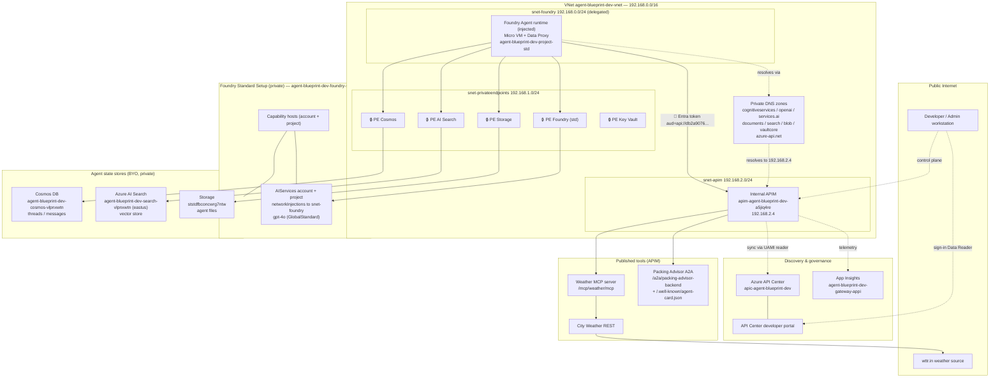
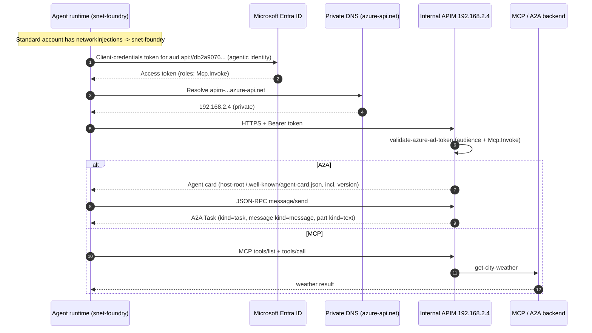
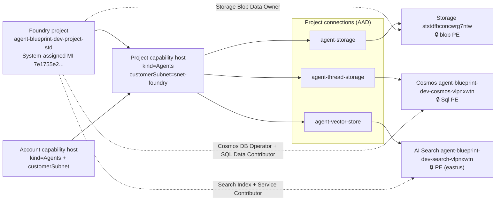
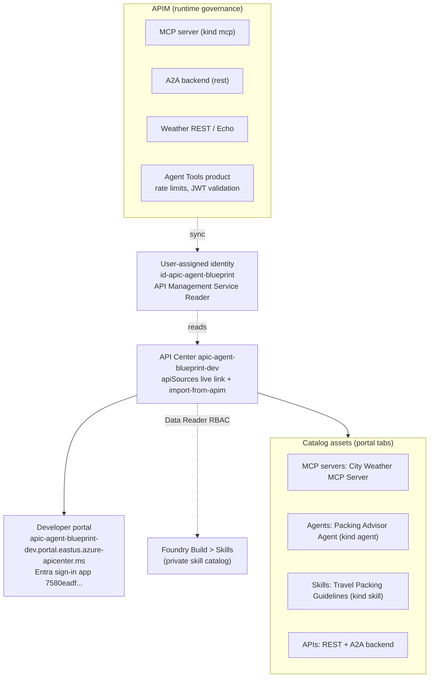

# Chapter 04a — Architecture Overview (through Chapter 04)

This chapter consolidates everything built in Chapters 01–04 into one architecture view: Microsoft
Foundry (Basic + network‑injected Standard), the APIM AI Gateway, Azure API Center, the agent state
stores (Cosmos DB, AI Search, Storage), agent identity and token flow, private networking, and the
discovery/governance plane.

All names, subnets, and IPs below reflect the deployed `dev` environment in resource group
`rg-agentic-ai-blueprint-dev`.

---

## 1. Legend

| Symbol | Meaning |
|---|---|
| 🔒 Private endpoint | Traffic stays on the VNet via Azure Private Link |
| 🟦 Delegated subnet | `snet-foundry` delegated to `Microsoft.App/environments` (agent injection) |
| 🎫 Agentic identity | Per‑project managed identity that mints Entra tokens for tools |
| ⟶ solid | Runtime data‑plane call |
| ⟼ dashed | Control‑plane / discovery / sync |

---

## 2. End‑to‑end topology

---

## 3. Governed agent tool‑call flow (identity + gateway)

The path that makes MCP (weather) and A2A (packing advisor) work end to end, entirely inside the VNet.

**Why each control exists**
- **Network injection** puts the agent runtime in `snet-foundry` so it uses VNet DNS and can reach the
  internal APIM (fixes *"host name could not be resolved from the selected network path"*).
- **Agentic identity + audience** `api://db2a9076-cbe6-4fbc-9204-12972c561a1f` (app
  `agent-blueprint-apim-agent-tools`) — the connection audience must be this Entra URI, never the APIM
  URL (fixes the *400 "failed to fetch agentic identity access token"*).
- **`Mcp.Invoke` app role** on the agent identity lets Entra mint the client‑credentials token and lets
  APIM's `validate-azure-ad-token` accept it.
- **A2A specifics:** card served at the **APIM host root**, includes `version`, and the JSON‑RPC
  response carries `kind` discriminators.

---

## 4. Standard Agent Setup (state + capability host)

The capability host provisions the agent's thread/message containers (Cosmos), vector store (AI
Search), and file store (Storage) **inside your resources**. Network injection is only available with
this Standard Setup.

---

## 5. Discovery & governance plane (API Center)

> **Note:** the `kind: agent`/`kind: skill` assets are discoverable, but their **Definition** tab is
> populated only via the portal *Register an asset* flow (dedicated preview API). The **Skills API**
> for runtime consumption does not support private networking.

---

## 6. Component inventory

| Layer | Component | Name | Key facts |
|---|---|---|---|
| Network | VNet | `agent-blueprint-dev-vnet` | `192.168.0.0/16` |
| Network | Agent subnet | `snet-foundry` | `192.168.0.0/24`, delegated `Microsoft.App/environments` |
| Network | PE subnet | `snet-privateendpoints` | `192.168.1.0/24` |
| Network | APIM subnet | `snet-apim` | `192.168.2.0/24`, APIM at `192.168.2.4` |
| Network | Peered VNet | `demovnet` (rg-sanjeevdemovm) | admin/data-plane test host |
| Foundry (01) | Basic account | `agent-blueprint-dev-foundry-a5jiq4re` | private, no injection |
| Foundry (01a) | Standard account | `agent-blueprint-dev-foundry-std-vlpnxwtn` | `networkInjections -> snet-foundry`, gpt-4o |
| Foundry (01a) | Project | `agent-blueprint-dev-project-std` | capability host, MI `7e1755e2...` |
| State | Cosmos DB | `agent-blueprint-dev-cosmos-vlpnxwtn` | threads/messages, private |
| State | AI Search | `agent-blueprint-dev-search-vlpnxwtn` | vectors, `eastus`, private |
| State | Storage | `ststdfbconcwrg7ntw` | agent files, private, Entra-only |
| Identity | Audience app | `agent-blueprint-apim-agent-tools` | `api://db2a9076-...`, role `Mcp.Invoke` |
| Gateway (02) | APIM | `apim-agent-blueprint-dev-a5jiq4re` | Internal VNet mode, Developer SKU |
| Gateway (02) | App Insights | `agent-blueprint-dev-gateway-appi` | APIM telemetry |
| Tools (02a) | Weather MCP | `/mcp/weather/mcp` | agentic-identity |
| Tools (02a) | A2A backend | `/a2a/packing-advisor-backend` | + host-root `/.well-known/agent-card.json` |
| Catalog (04) | API Center | `apic-agent-blueprint-dev` | live APIM link + import |
| Catalog (04) | Sync identity | `id-apic-agent-blueprint` | API Management Service Reader |
| Catalog (04) | Portal app | clientId `7580eadf-...` | SPA redirect to portal URL |

---

## 7. Private DNS zones (all linked to the VNet)

| Zone | Resolves | Private IP target |
|---|---|---|
| `privatelink.cognitiveservices.azure.com` | Foundry account | PE in `snet-privateendpoints` |
| `privatelink.openai.azure.com` | Foundry OpenAI endpoint | PE |
| `privatelink.services.ai.azure.com` | Foundry project endpoint | PE |
| `privatelink.documents.azure.com` | Cosmos DB | PE |
| `privatelink.search.windows.net` | AI Search | PE |
| `privatelink.blob.core.windows.net` | Storage blob | PE |
| `privatelink.vaultcore.azure.net` | Key Vault | PE |
| `azure-api.net` | Internal APIM gateway | `192.168.2.4` |

---

## 8. Trust & data-flow summary

1. **Agent → tools:** agentic identity token (aud `api://db2a9076...`, role `Mcp.Invoke`) → internal
   APIM (resolved to `192.168.2.4` via `azure-api.net`) → MCP/A2A backends. All in-VNet.
2. **Agent → model:** private endpoint to the Standard Foundry account → gpt-4o.
3. **Agent → state:** threads to Cosmos, files to Storage, vectors to AI Search — each over a private
   endpoint, Entra-authenticated, public access disabled.
4. **APIM → API Center:** the API Center user-assigned identity reads APIM and syncs APIs + MCP servers
   into the catalog; typed Agent/Skill assets are added for discovery.
5. **Humans → discovery:** developer portal (Entra sign-in) and Foundry Build → Skills, gated by
   `Azure API Center Data Reader`.

---

## Related chapters

- [01 — Foundry BYO networking](./01-foundry-byo-networking.md) · [infra 01a — Standard + network injection](../infra/chapter-01a-standard-agent-network-injection/README.md)
- [02 — AI Gateway](./02-ai-gateway.md) · [02a — MCP & A2A](./02a-mcp-a2a-samples.md)
- [04 — API Center](./04-api-center.md) · [infra 04](../infra/chapter-04-api-center/README.md)
