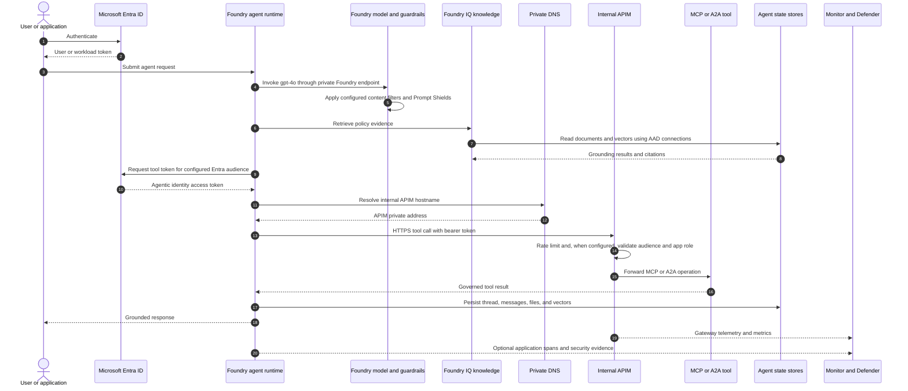

# End-to-End Deployed Architecture

This document describes the Azure agent platform implemented by the infrastructure and operational
scripts through Chapter 16. It consolidates the network foundation, Microsoft Foundry environments,
agent state, AI gateway, MCP and A2A tools, API Center, Foundry IQ, observability, content safety, and
Defender for AI into one current-state architecture.

The architecture uses two Foundry accounts. The original private **Basic** account remains available
as the APIM model backend. The **Standard** account adds customer-owned state and agent network
injection and hosts the governed travel agent. These are separate resources and should not be
confused as two views of the same account.

## 1. Implementation Status Legend

| Status | Meaning |
|---|---|
| **Deployed** | Created or configured by Bicep or an executed deployment script |
| **Data-plane** | Created through Foundry, an SDK, or an API after infrastructure deployment |
| **Manual** | Requires a documented portal or CLI configuration step |
| **Optional** | Created only when a deployment flag or parameter is supplied |
| **Documented only** | A target-state control that is not configured by the current implementation |

This distinction matters for controls such as APIM token validation, custom guardrail assignment,
Application Insights migration, alert rules, and Microsoft Sentinel integration. The repository
documents those controls, but not all of them are automatically deployed.

## 2. End-to-End Architecture

```mermaid
flowchart TB
    user[Developer, operator, or consuming application]
    entra[Microsoft Entra ID]
    defender[Microsoft Defender for Cloud<br/>Defender for AI]

    subgraph vnet["Platform VNet: agent-blueprint-dev-vnet - 192.168.0.0/16"]
        subgraph agentSubnet["snet-foundry - 192.168.0.0/24"]
            runtime[Network-injected Foundry agent runtime]
        end

        subgraph apimSubnet["snet-apim - 192.168.2.0/24"]
            apim[Internal Azure API Management]
        end

        subgraph peSubnet["snet-privateendpoints - 192.168.1.0/24"]
            foundryPE[Foundry private endpoints]
            cosmosPE[Cosmos DB private endpoint]
            searchPE[AI Search private endpoint]
            storagePE[Storage private endpoints]
            vaultPE[Key Vault private endpoint]
        end

        dns[Private DNS zones and VNet links]
    end

    subgraph foundry[Microsoft Foundry]
        basic[Basic private account and project]
        standard[Standard private account and project]
        model[gpt-4o]
        embedding[text-embedding-3-small]
        capability[Account and project capability hosts]
        demoAgent[GovernedTravelSecurityDemo]
        guardrail[RAI policy and Prompt Shields]
    end

    subgraph state[Customer-owned agent state and knowledge]
        cosmos[Cosmos DB<br/>threads and messages]
        search[Azure AI Search<br/>vectors and knowledge index]
        storage[Blob Storage<br/>files and source documents]
        vault[Azure Key Vault]
    end

    subgraph tools[Governed tool plane]
        weatherMcp[Weather MCP API]
        weatherRest[Weather REST adapter]
        packingA2A[Packing Advisor A2A API]
        wttr[wttr.in external weather service]
    end

    subgraph discovery[Discovery and governance]
        apiCenter[Azure API Center]
        catalog[APIs, MCP servers, agents, skills, metadata]
        portal[API Center developer portal]
    end

    subgraph monitor[Observability and security operations]
        appi[Application Insights]
        law[Log Analytics workspace]
        workbook[Agent Platform Observability workbook]
        purview[Microsoft Purview prompt sharing]
    end

    user -->|Entra authentication| entra
    entra --> runtime
    runtime -->|Private Foundry endpoint| standard
    standard --> model
    standard --> embedding
    standard --> capability
    standard --> demoAgent
    standard --> guardrail

    runtime -->|AAD connection| cosmosPE --> cosmos
    runtime -->|AAD connection| searchPE --> search
    runtime -->|AAD connection| storagePE --> storage
    runtime -.-> dns

    runtime -->|Agentic identity token| apim
    apim --> weatherMcp --> weatherRest --> wttr
    apim --> packingA2A
    apim -->|Managed identity| basic

    apim -.->|Managed identity reads and synchronizes| apiCenter
    apiCenter --> catalog --> portal

    apim -->|Logger telemetry| appi
    apim -->|GatewayLogs and AllMetrics| law
    appi --> workbook
    law --> workbook
    standard -.->|Optional OpenTelemetry spans| appi
    defender -.->|Inventory, posture, detections, prompt evidence| standard
    defender -.-> purview
```

## 3. Runtime Request and Trust Flow

The bearer token check shown at APIM is a documented post-deployment policy step. Chapter 02a
deploys rate limiting, but its Bicep does not automatically add `validate-azure-ad-token`. Production
readiness therefore requires verifying that the policy is present on every protected MCP and A2A API.

## 4. Component Inventory

### 4.1 Network Foundation

| Component | Implementation | Purpose and security behavior | Status |
|---|---|---|---|
| Platform VNet | `agent-blueprint-dev-vnet`, `192.168.0.0/16` | Main network trust boundary for agent compute, APIM, and private endpoints | Deployed |
| Foundry subnet | `snet-foundry`, `192.168.0.0/24` | Delegated to `Microsoft.App/environments`; Standard agent compute is injected here so tool egress uses VNet routing and DNS | Deployed |
| Private endpoint subnet | `snet-privateendpoints`, `192.168.1.0/24` | Dedicated subnet for service private endpoints; private endpoint network policies are disabled as required by Private Link | Deployed |
| APIM subnet | `snet-apim`, `192.168.2.0/24` | Hosts internal APIM; attached to the APIM NSG | Deployed |
| APIM NSG | `agent-blueprint-dev-apim-nsg` | Allows required APIM management, load balancer, VNet client, Storage, SQL, Key Vault, Entra, and Azure Monitor flows | Deployed |
| Private DNS | Eight service zones plus VNet links | Resolves public Azure service names to private endpoint addresses and resolves the APIM hostname internally | Deployed |
| Additional VNet DNS links | `additionalLinkedVnetIds` | Allows a peered administration or build VNet to resolve private Cosmos DB and AI Search endpoints | Optional |

The APIM NSG is attached only to `snet-apim`. It is not an outbound firewall for the Foundry subnet.
The network-injected agent can reach VNet resources and any permitted external destinations. A
central firewall, NAT gateway, or explicit Foundry-subnet route table is not deployed by these
templates.

### 4.2 Private DNS and Private Link

| Private DNS zone | Service resolved through Private Link |
|---|---|
| `privatelink.cognitiveservices.azure.com` | Foundry AI Services endpoint |
| `privatelink.openai.azure.com` | Azure OpenAI model endpoint |
| `privatelink.services.ai.azure.com` | Foundry project endpoint |
| `privatelink.documents.azure.com` | Cosmos DB SQL endpoint |
| `privatelink.search.windows.net` | Azure AI Search endpoint |
| `privatelink.blob.core.windows.net` | Blob Storage endpoint |
| `privatelink.vaultcore.azure.net` | Key Vault endpoint |
| `azure-api.net` | Internal APIM gateway hostname; A records are added after deployment |

Foundry, Cosmos DB, AI Search, Storage, and Key Vault deny public data-plane access. Private
endpoints provide addresses in `snet-privateendpoints`; DNS zone groups register the service names
against those endpoints. This combination prevents a workload from silently falling back to the
public service endpoint.

### 4.3 Original Private Foundry Environment

| Component | Purpose and security behavior | Status |
|---|---|---|
| Basic Foundry account | Private `AIServices` account with system-assigned identity, local key authentication disabled, public access disabled, and default-deny network ACLs | Deployed |
| Basic Foundry project | Original project with its own system-assigned managed identity | Deployed |
| `gpt-4o` deployment | Original model endpoint; also selected as the APIM model backend in the Chapter 02 deployment | Optional by template; present in the documented environment |
| Original Storage account | Entra-only blob storage with shared keys and blob public access disabled, TLS 1.2 minimum, and a blob private endpoint | Deployed |
| Key Vault | RBAC authorization, private access, soft delete, 90-day retention, and purge protection | Deployed |

The Basic account has private service access but does not provide the complete Standard Agent Setup
used for customer-managed threads, vectors, files, and agent network injection.

### 4.4 Standard Agent Environment

| Component | Purpose and security behavior | Status |
|---|---|---|
| Standard Foundry account | Private `AIServices` account with system-assigned identity and `networkInjections` targeting `snet-foundry` | Deployed |
| Standard Foundry project | Hosts governed agents and has a system-assigned identity used for customer-owned state | Deployed |
| Account capability host | Associates the Agents capability with the customer subnet | Deployed by Bicep |
| Project capability host | Binds Storage, Cosmos DB, and AI Search project connections | Deployed by Bicep |
| `gpt-4o` deployment | Chat model used by the governed travel agent | Optional by template; used by the demo |
| Project connections | AAD-authenticated `agent-storage`, `agent-thread-storage`, and `agent-vector-store` connections | Deployed by Bicep |

Network injection is the control that causes hosted agent tool calls to originate through
`snet-foundry`. Merely creating a Foundry private endpoint does not inject the hosted runtime and is
not enough for an agent to reach internal APIM.

### 4.5 Customer-Owned Agent State

| Component | Data held | Security implementation | Status |
|---|---|---|---|
| Cosmos DB | Agent threads and messages | Public access and local authentication disabled; private SQL endpoint; Session consistency; project identity has Cosmos DB Operator and SQL Data Contributor | Deployed |
| Azure AI Search | Agent vector stores and Foundry IQ index | Public and local authentication disabled; private endpoint; system identity; project identity has Search Service Contributor and Search Index Data Contributor; semantic ranker enabled | Deployed |
| Standard agent Storage | Agent files and knowledge source documents | Public and shared-key access disabled; TLS 1.2; private blob endpoint; project identity has Storage Blob Data Owner | Deployed |

Cosmos DB exists because Standard Agent Setup requires a customer-owned thread and message store.
It is not an observability database and is not used for Log Analytics or Defender data.

The capability host creates and uses the necessary state structures inside these resources. All
three Foundry project connections use `authType: AAD`; no storage key, Cosmos key, or Search admin key
is embedded in the connection.

### 4.6 AI Gateway and Tool Plane

| Component | Purpose and security behavior | Status |
|---|---|---|---|
| Azure API Management | Internal gateway for model APIs, REST APIs, MCP servers, and A2A endpoints; reachable from the VNet at a private address | Deployed |
| APIM system identity | Calls the Basic Foundry model backend without a model API key | Deployed |
| `Cognitive Services OpenAI User` role | Least-privilege model invocation permission for APIM on the selected Foundry account | Deployed |
| Application Insights logger | Telemetry sink registered with APIM | Deployed |
| Agent Tools product | Groups the weather REST, weather MCP, and Packing Advisor A2A APIs | Deployed |
| Weather REST API | APIM adapter over `https://wttr.in`; injects `format=j1` | Deployed |
| Weather MCP server | Streamable MCP facade exposing `get-city-weather`; rate limited per caller IP | Deployed |
| Packing Advisor A2A API | Sample A2A agent card and JSON-RPC `message/send` endpoint; rate limited and returns a synthetic checklist | Deployed |
| Entra audience application and `Mcp.Invoke` role | Defines the tool API audience and application permission consumed by agentic identities | Manual/post-deployment |
| APIM token validation policy | Validates tenant, audience, and expected app role before forwarding a tool call | Manual/post-deployment |

APIM is the policy enforcement and telemetry boundary. Tool consumers should not call backends
directly. Rate limiting is deployed in Chapter 02a. Entra token enforcement must be verified
separately because it is described in the test procedure rather than codified in that Bicep file.

The weather backend is intentionally external, so that specific call leaves the Azure VNet after
APIM forwards it to `wttr.in`. All claims that the solution is fully private must exclude this demo
backend or replace it with an approved private weather service.

### 4.7 API Center Discovery and Governance

| Component | Purpose and security behavior | Status |
|---|---|---|---|
| API Center | Enterprise inventory for APIs, MCP servers, agents, skills, and plugins | Deployed |
| API Center user-assigned identity | Reads APIM for synchronization without stored credentials | Deployed |
| API Management Service Reader role | Limits the synchronization identity to APIM discovery | Deployed |
| APIM `apiSources` link | Maintains the connection between APIM and the API Center default workspace | Deployed |
| Governance metadata | `owning-team`, `data-classification`, and `agent-protocol` schemas | Optional; enabled by default |
| Packing Advisor agent asset | Catalog entry pointing to the A2A agent card | Optional; enabled by default |
| Travel Packing skill asset | Catalog entry pointing to the skill definition | Optional; enabled by default |
| Sample catalog assets | Demonstration MCP, agent, skill, and plugin records | Optional; enabled by default |
| Catalog reader RBAC | Grants a supplied principal Azure API Center Data Reader | Optional |
| Developer portal and Entra sign-in app | Human discovery interface with Entra authentication | Manual/post-deployment |

API Center is the discovery and governance plane; APIM remains the runtime enforcement plane. A
catalog record does not itself authorize invocation of the represented API, agent, or skill.

### 4.8 Foundry IQ Knowledge Layer

| Component | Purpose and security behavior | Status |
|---|---|---|---|
| `text-embedding-3-small` | Generates 1,536-dimension vectors for documents and queries | Deployed |
| `knowledge-base` blob container | Stores private travel and expense policy source documents | Deployed |
| Private index builder | Reads blobs, calls the private embedding endpoint, and writes vectors directly to private AI Search | Scripted data-plane operation |
| Foundry IQ knowledge index | Hybrid/vector retrieval over enterprise policy documents | Data-plane; used by the demo agent |
| Foundry IQ MCP connection | Presents grounded policy retrieval as an agent tool | Data-plane; used by the demo agent |

The fully private build path must run from a VNet-connected host that can resolve and reach Storage,
Foundry, and AI Search private endpoints. The Azure portal control plane does not automatically gain
data-plane access to private services.

### 4.9 Governed Demo Agent

`GovernedTravelSecurityDemo` is a persistent Foundry agent version using `gpt-4o` and three tools:

1. The Foundry IQ knowledge MCP retrieves policy evidence and citations.
2. The APIM Weather MCP retrieves weather through the governed gateway.
3. The Packing Advisor A2A connection delegates checklist generation to the APIM-hosted sample.

The saved Chapter 16 report demonstrates a grounded policy response, an A2A packing result, and a
prompt-injection attempt blocked by the model content-management policy. The report also records a
weather-tool constraint, so weather success should be validated independently before a live demo.

## 5. Identity Security and RBAC

### 5.1 Identity Types

| Identity | Trust purpose | Permissions in this implementation |
|---|---|---|
| Human developer/operator | Builds, deploys, observes, or administers the platform | Optional Foundry User and API Center Data Reader assignments; Azure control-plane roles are tenant-managed |
| Basic Foundry account identity | Service identity for the original Foundry account | System assigned; no broad cross-service role is added by Chapter 01 |
| Standard Foundry account identity | Service identity for the network-injected account | System assigned; account-level platform operations |
| Standard Foundry project identity | Provisions and accesses customer-owned state | Storage Blob Data Owner, Cosmos DB Operator, Cosmos SQL Data Contributor, Search Service Contributor, Search Index Data Contributor |
| Agentic identity | Obtains a client-credentials token for an agent tool connection | Expected assignment to the audience application's `Mcp.Invoke` app role |
| APIM system identity | Calls the selected Foundry model backend | Cognitive Services OpenAI User on that Foundry account |
| API Center user-assigned identity | Synchronizes the API catalog from APIM | API Management Service Reader on APIM |
| AI Search system identity | Search service identity for supported service-to-service operations | Created, with no additional role assignment in this deployment slice |

### 5.2 Agent Identity Flow

The project managed identity and the agentic identity solve different problems:

- The **project managed identity** accesses the project's customer-owned Storage, Cosmos DB, and AI
  Search resources through AAD project connections.
- The **agentic identity** represents the agent when it requests an Entra token for an external tool
  connection. The token audience must be the API application's Application ID URI, not the APIM URL.
- APIM should validate the token issuer, audience, and `Mcp.Invoke` role before processing the MCP or
  A2A request.

This design avoids shared API keys, gives each trust path an auditable service principal, and allows
permissions to be revoked without changing application secrets.

### 5.3 Least Privilege Boundaries

- Local/key authentication is disabled on Foundry, Standard agent Storage, Cosmos DB, and AI Search.
- The project identity receives data-plane roles only on the three resources required by the
  capability host.
- APIM receives model invocation permission, not Foundry account administration.
- API Center receives read-only access to APIM for synchronization.
- Human Foundry and catalog access is parameterized rather than granted to every subscription user.
- Key Vault uses Azure RBAC instead of legacy access policies.

The current templates do not deploy a user-assigned identity per agent. That pattern is described in
the governance chapters as a target design, while the working tool flow uses Foundry agentic identity.

## 6. Network Isolation and Traffic Controls

### 6.1 Controls Implemented

1. **Service public access is denied.** Foundry, Cosmos DB, AI Search, Storage, and Key Vault expose
   their data planes through private endpoints.
2. **Hosted agent compute is network injected.** Standard account `networkInjections` places agent
   execution into `snet-foundry` and disables the Microsoft-managed network path for that scenario.
3. **APIM is internal.** `virtualNetworkType: Internal` places the gateway in `snet-apim`; VNet DNS
   resolves the APIM hostname to its private address.
4. **Subnets are separated by function.** Delegated compute, private endpoints, and APIM do not share
   a subnet.
5. **Private DNS is linked to the VNet.** Workloads resolve the private endpoint address instead of a
   blocked public address.
6. **APIM has an NSG.** Required Azure platform ingress and service-tag egress are explicit.
7. **Encryption in transit is required.** Storage enforces HTTPS and TLS 1.2; Azure service endpoints
   and APIM calls use HTTPS.

### 6.2 Remaining Network Considerations

- No Azure Firewall, web application firewall, DDoS Network Protection plan, NAT gateway, or forced
  tunneling is deployed by the current templates.
- The Foundry subnet has no dedicated NSG or user-defined route in this implementation.
- The weather sample deliberately calls a public Internet service from APIM.
- Azure management operations and Entra token acquisition use Azure public control-plane endpoints,
  subject to Azure service routing and the APIM NSG service tags.
- A peered build or administration VNet needs links to every required private DNS zone; peering alone
  is not enough.

## 7. Observability Architecture

### 7.1 Telemetry Components

| Component | Collected data | Security and operational purpose | Status |
|---|---|---|---|
| Application Insights | APIM logger telemetry and optional custom OpenTelemetry spans | Agent invocation, model usage, tool latency, exceptions, and trace correlation | Deployed; custom span export is optional |
| Log Analytics workspace | APIM `GatewayLogs` and `AllMetrics` | Central KQL store for gateway requests, failures, latency, and operational investigation | Deployed |
| APIM diagnostic setting | Routes gateway logs and metrics to Log Analytics | Durable resource-level audit and operations data | Deployed |
| Agent Platform Observability workbook | Queries Application Insights and Log Analytics | Shared dashboard for success rate, token cost estimates, tool latency, throughput, and gateway errors | Deployed |
| Evaluation script | Groundedness, relevance, coherence, fluency, violence, and hate/unfairness evaluations | Pre-release quality and safety assessment | Scripted |
| Red-team scanner | Adversarial evaluation and attack-success-rate threshold | CI/CD safety gate; exits nonzero above the configured threshold | Scripted |

The Log Analytics workspace uses the `PerGB2018` SKU, 30-day default retention, and resource-context
log access. Increasing retention is supported by the deployment parameter up to 730 days.

The Application Insights resource is initially created independently. The Chapter 15 deployment can
optionally migrate it to the Log Analytics workspace. Without that flag, workbook panels can still
query both resources, but telemetry is not consolidated into one workspace-based Application
Insights resource.

### 7.2 Workbook Views

The deployed workbook provides these operational views:

- Agent success rate over 24 hours from custom agent invocation events.
- Estimated model cost over seven days from prompt and completion token counts.
- Tool latency percentiles over 24 hours.
- APIM throughput, error rate, and average latency in five-minute intervals.

Custom agent and tool panels require the demo or application to export the expected OpenTelemetry
events. APIM gateway panels require traffic after the diagnostic setting is enabled.

### 7.3 Observability Gaps

- Foundry account diagnostic settings are not deployed in the current Bicep.
- Azure Monitor alert rules and action groups are documented but not deployed.
- Microsoft Sentinel integration is documented but not configured.
- Long-term archive, immutable logging, and cross-region log replication are not configured.
- APIM's Application Insights logger exists, but per-API diagnostic behavior should be verified for
  each production API.

## 8. Content Safety and Security Monitoring

### 8.1 Foundry Guardrails

The `agent-guardrail-v1` RAI policy is based on `Microsoft.DefaultV2`, operates in blocking mode, and
configures:

| Filter | Direction | Blocking threshold |
|---|---|---|
| Violence | Prompt and completion | Medium and above |
| Hate | Prompt and completion | Medium and above |
| Sexual | Prompt and completion | Medium and above |
| Self-harm | Prompt and completion | Medium and above |
| Jailbreak Prompt Shield | Prompt | Detected attacks blocked |
| Indirect Attack Prompt Shield | Prompt | Detected attacks blocked |

The policy resource is deployed by default but is not assigned to a model deployment unless
`deploy.ps1` is run with `-ApplyGuardrailToDeployment`. The saved demo report proves that a jailbreak
was detected and filtered by the active platform content-management policy; it does not by itself
prove that the custom `agent-guardrail-v1` policy was the assigned policy.

### 8.2 Defender for AI

The Chapter 16 script configures the subscription-level Defender for AI plan:

| Defender capability | Configuration | Status |
|---|---|---|
| Defender for AI pricing plan | Standard | Deployed or verified by script |
| AI Prompt Evidence | Enabled | Deployed or verified by script |
| AI Prompt Sharing with Purview | Enabled | Deployed or verified by script |
| AI Model Scanner | Preserves current state unless `-EnableModelScanner` is supplied | Optional |
| Security contact | Sends alerts at the configured minimum severity and notifies subscription Owners | Optional |

Defender for AI adds security posture, workload inventory, recommendations, detections, and prompt
evidence at the subscription security layer. It complements rather than replaces Foundry content
filters:

- **Content filters** block unsafe prompts or completions inline.
- **APIM policies** authenticate, authorize, throttle, and log tool traffic.
- **Defender for AI** detects suspicious behavior and produces security findings and evidence.
- **Log Analytics and Application Insights** support operational investigation and correlation.
- **Purview sharing** supports data-security investigation when enabled by Defender.

Defender alerts are detection driven. The demo validates the content-filter response but does not
manufacture a Defender security incident.

### 8.3 Defense-in-Depth Map

| Layer | Main controls |
|---|---|
| User and administrator | Entra authentication, Azure RBAC, optional scoped Foundry and API Center roles |
| Agent | Foundry agentic identity, scoped tool app role, private project |
| Model | Private endpoint, Entra authentication, RAI content filters, Prompt Shields |
| Knowledge and state | Private endpoints, AAD project connections, service-specific data roles, no local keys |
| Tool gateway | Internal APIM, NSG, Entra token policy when configured, rate limiting, centralized logging |
| Discovery | API Center managed identity, reader role, governance metadata, catalog reader RBAC |
| Operations | Application Insights, Log Analytics, workbook, evaluations, red-team gate |
| Security operations | Defender for AI, prompt evidence, Purview sharing, optional security notifications |

## 9. End-to-End Data Flows

### 9.1 Grounded Agent Request

1. A user authenticates with Entra and invokes the Foundry agent.
2. The network-injected runtime calls `gpt-4o` through the Standard Foundry private endpoint.
3. The agent calls the Foundry IQ MCP connection to retrieve enterprise policy evidence.
4. Foundry IQ reads source documents from private Blob Storage, creates or compares embeddings, and
   queries the private AI Search index.
5. The model produces an answer with retrieved citations while content filters inspect prompts and
   completions.
6. Thread and message state is persisted in private Cosmos DB; files and vector state remain in the
   customer-owned Storage and Search resources.

### 9.2 Governed Tool Call

1. The agentic identity requests an Entra access token for the configured tool audience.
2. Private DNS resolves the APIM gateway hostname to its internal VNet address.
3. The agent sends the token and request over HTTPS to internal APIM.
4. APIM applies the configured authentication policy, rate limit, request transformation, and
   telemetry behavior.
5. APIM invokes the MCP or A2A backend and returns the result to the agent.
6. Gateway logs and metrics flow to Log Analytics; configured APIM telemetry flows to Application
   Insights.

### 9.3 Discovery and Publication

1. APIM contains the runtime API, MCP, and A2A definitions.
2. API Center's user-assigned identity reads APIM through the `apiSources` link.
3. API Center combines synchronized APIs with agent, skill, plugin, ownership, classification, and
   protocol metadata.
4. Authorized users browse the developer portal after its Entra identity provider is configured.
5. Runtime authorization remains enforced by APIM and the target service, not by catalog visibility.

### 9.4 Security and Operations

1. Foundry content filters inspect prompts and completions inline.
2. APIM records gateway activity and metrics.
3. Application code can export correlated OpenTelemetry spans to Application Insights.
4. The workbook combines application and gateway views for operators.
5. Evaluation and red-team scripts assess quality and safety before release.
6. Defender for AI assesses the subscription's AI workload posture and produces evidence or alerts
   when its detections identify a signal.

## 10. Current-State Resource Summary

Names below reflect the documented `dev` deployment. Unique suffixes are environment specific.

| Layer | Documented resource |
|---|---|
| Resource group | `rg-agentic-ai-blueprint-dev` |
| VNet | `agent-blueprint-dev-vnet` |
| Basic Foundry account | `agent-blueprint-dev-foundry-a5jiq4re` |
| Basic Foundry project | `agent-blueprint-dev-project` |
| Standard Foundry account | `agent-blueprint-dev-foundry-std-vlpnxwtn` |
| Standard Foundry project | `agent-blueprint-dev-project-std` |
| Cosmos DB | `agent-blueprint-dev-cosmos-vlpnxwtn` |
| AI Search | `agent-blueprint-dev-search-vlpnxwtn` |
| Standard agent Storage | `ststdfbconcwrg7ntw` |
| APIM | `apim-agent-blueprint-dev-a5jiq4re` |
| Application Insights | `agent-blueprint-dev-gateway-appi` |
| API Center | `apic-agent-blueprint-dev` |
| API Center sync identity | `id-apic-agent-blueprint` |
| Log Analytics workspace | `agent-blueprint-dev-law` |
| Workbook | `Agent Platform Observability` |
| Guardrail policy | `agent-guardrail-v1` |
| Demo agent | `GovernedTravelSecurityDemo` |

## 11. Deployment and Control Status

| Capability | Status | Required follow-up |
|---|---|---|
| Private VNet, subnets, endpoints, and DNS | Deployed | Validate resolution from every runtime and admin VNet |
| Basic private Foundry environment | Deployed | Retire it when no APIM or workload dependency remains |
| Standard Agent Setup and network injection | Deployed | Recreate agents and connections only on the Standard project |
| Customer-owned Storage, Cosmos DB, and AI Search | Deployed | Monitor capacity, backup, retention, and regional resilience |
| Internal APIM and managed model authentication | Deployed | Verify per-API diagnostics and backend configuration |
| Weather MCP and Packing Advisor A2A | Deployed | Replace demo/external backends for production |
| APIM rate limiting | Deployed | Tune limits and keys to the production consumer model |
| Agentic identity audience, app role, and APIM validation | Manual/post-deployment | Verify `Mcp.Invoke` assignment and token policy on every tool API |
| API Center and catalog synchronization | Deployed | Configure portal identity provider and catalog reader access |
| Foundry IQ embedding model and document container | Deployed | Build or refresh the data-plane index from a private host |
| Foundry IQ knowledge connection | Data-plane | Validate freshness, citations, and retrieval quality |
| Log Analytics, APIM diagnostics, and workbook | Deployed | Generate traffic and confirm KQL tables populate |
| Application Insights custom agent spans | Optional | Set connection string and instrument production agent code |
| Custom RAI policy | Created | Explicitly assign it to each intended model deployment |
| Evaluations and red-team gate | Scripted | Integrate into CI/CD and retain reports |
| Defender for AI Standard | Scripted deployment/verification | Review posture, recommendations, prompt evidence, and alert routing |
| Model Scanner | Optional | Enable only after reviewing scope, privacy, and cost |
| Security contact | Optional | Configure the SOC mailbox and severity threshold |
| Azure Monitor alert rules | Documented only | Deploy action groups and operational/security alerts |
| Microsoft Sentinel integration | Documented only | Connect Defender and Azure Monitor sources to the SOC workspace |
| Per-agent user-assigned managed identity | Documented only | Adopt if required beyond Foundry agentic identity |
| Firewall and forced egress inspection | Not deployed | Add when policy requires controlled Internet egress |

## 12. Production Hardening Priorities

1. Codify the Entra audience application, `Mcp.Invoke` assignment, and APIM
   `validate-azure-ad-token` policy so tool authorization does not depend on portal configuration.
2. Verify and enforce the custom RAI policy assignment on every production model deployment.
3. Replace `wttr.in` and the synthetic Packing Advisor with approved backends and private connectivity
   where required.
4. Add Foundry diagnostic settings, Azure Monitor alerts, action groups, and Microsoft Sentinel
   integration.
5. Add controlled egress through Azure Firewall or another approved inspection layer if unrestricted
   outbound traffic from agent compute is not acceptable.
6. Define Cosmos DB, Storage, AI Search, and Log Analytics retention, backup, replication, and
   disaster-recovery requirements.
7. Move environment-specific names and connection identifiers out of demo scripts and validate all
   dependencies before agent creation.
8. Review broad data-owner roles after capability-host provisioning and reduce them where supported
   by the service lifecycle.

## 13. Source Map

- [Chapter 01 networking](./01-foundry-byo-networking.md)
- [Chapter 02 AI gateway](./02-ai-gateway.md)
- [Chapter 02a MCP and A2A](./02a-mcp-a2a-samples.md)
- [Chapter 04 API Center](./04-api-center.md)
- [Chapter 06 Foundry IQ](./06-foundry-iq-knowledge.md)
- [Chapter 15 observability](./15-observability.md)
- [Chapter 16 Defender](./16-defender.md)
- [Existing architecture through Chapter 04](./04a-architecture-overview.md)
- [Chapter 01 infrastructure](../infra/chapter-01-foundry-byo-networking/main.bicep)
- [Standard Agent Setup infrastructure](../infra/chapter-01a-standard-agent-network-injection/main.bicep)
- [APIM infrastructure](../infra/chapter-02-ai-gateway/main.bicep)
- [MCP and A2A infrastructure](../infra/chapter-02a-mcp-a2a/main.bicep)
- [API Center infrastructure](../infra/chapter-04-api-center/main.bicep)
- [Foundry IQ infrastructure](../infra/chapter-06-foundry-iq/main.bicep)
- [Observability infrastructure](../infra/chapter-15-observability/main.bicep)
- [Defender deployment](../infra/chapter-16-defender/deploy.ps1)
- [End-to-end demo report](../chapter-16-demo-report.json)