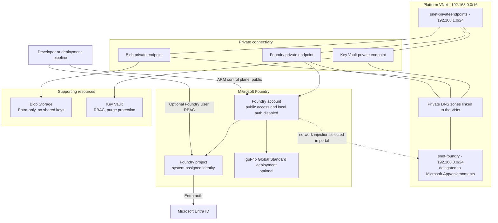

# Chapter 01 deployment

This folder turns `chapters/01-foundry-byo-networking.md` into a repeatable Azure deployment.
It provisions a private Microsoft Foundry account and project on a bring-your-own network, with
private endpoints and VNet-linked DNS so all data-plane access stays inside the VNet.

## What is deployed

### End-state architecture



### Resources created by the Bicep template

| Resource | Bicep behavior | Purpose |
|---|---|---|
| Virtual network | Created only when no existing VNet is supplied; `192.168.0.0/16` by default | Network trust boundary for agent compute and private endpoints |
| `snet-foundry` subnet | `/24`, delegated to `Microsoft.App/environments` | Dedicated subnet for Foundry Agent Service network injection |
| `snet-privateendpoints` subnet | `/24`, private endpoint network policies disabled | Hosts the private endpoints for Foundry, Storage, and Key Vault |
| Foundry account | Private `AIServices` account; `publicNetworkAccess` disabled, `disableLocalAuth` true, default-deny network ACLs, system-assigned identity | The Microsoft Foundry account that hosts the project and model |
| Foundry project | Child project with its own system-assigned managed identity | The project used to build agents |
| `gpt-4o` deployment | Global Standard, capacity 30; created by an idempotent CLI step in `deploy.ps1`, not in-template | Chat model for the project (optional, quota permitting) |
| Storage account | Standard LRS; blob public access, shared-key access disabled; HTTPS and TLS 1.2 required | Private Blob Storage from the chapter |
| Key Vault | RBAC authorization, soft delete, 90-day retention, purge protection, public access disabled | Private secret and key store from the chapter |
| Foundry private endpoint | Targets the `account` group in `snet-privateendpoints` | Private access to the Foundry account and project endpoints |
| Storage private endpoint | Targets the `blob` group | Private access to Blob Storage |
| Key Vault private endpoint | Targets the `vault` group | Private access to Key Vault |
| Foundry private DNS zones | `privatelink.cognitiveservices.azure.com`, `privatelink.openai.azure.com`, `privatelink.services.ai.azure.com`, linked to the VNet | Resolve the three Foundry endpoint suffixes to the private endpoint |
| Blob private DNS zone | `privatelink.blob.<storage suffix>`, linked to the VNet | Resolves Blob Storage to its private endpoint |
| Key Vault private DNS zone | `privatelink.vaultcore.azure.net`, linked to the VNet | Resolves Key Vault to its private endpoint |
| Foundry User role assignment | Created only when a principal ID is supplied (`deploy.ps1` defaults it to the signed-in user) | Grants data-plane access to build agents in the project |

### Security posture

- Foundry, Storage, and Key Vault deny public data-plane access; access is through private endpoints only.
- Local API-key and shared-key authentication are disabled; access uses Microsoft Entra ID.
- The delegated `snet-foundry` subnet is separated from the private endpoint subnet.
- Storage requires HTTPS and TLS 1.2; Key Vault uses RBAC with purge protection.

### Not created by this chapter

- Azure AI Search and Cosmos DB (customer-owned agent state) and the capability host are introduced in Chapter 01a.
- Agents and tool connections are post-deployment data-plane resources.
- No firewall, NAT gateway, route table, or subnet NSG is deployed here.


## Important scope note

This deployment faithfully implements the resources listed in Chapter 01. Current Microsoft guidance for a fully functional **Standard Agent with private networking** additionally requires bring-your-own Azure AI Search and Azure Cosmos DB resources, their private endpoints, project connections, and a capability host. Those resources are not in the chapter and are therefore not silently added here.

Foundry Agent Service network injection must be selected when the account/agent environment is configured. The chapter performs this in the Foundry portal. Do this before creating any hosted agents:

1. Open the Foundry resource in the Azure portal or Microsoft Foundry portal.
2. Keep public network access disabled and select the existing Foundry private endpoint.
3. Select virtual network injection.
4. Choose the emitted VNet and `snet-foundry` delegated subnet.

## Defaults

| Setting | Value |
|---|---|
| Subscription | Current `az` context (override with `-SubscriptionName`) |
| Tenant | Current `az` context (override with `-Tenant`) |
| Resource group | `rg-agentic-ai-blueprint-dev` |
| Region | `eastus2` |
| Environment | `dev` |

The script uses whatever subscription and tenant `az` is currently signed in to. Pass
`-SubscriptionName` and/or `-Tenant` to target a specific one; when provided, the script verifies the
active context matches before deploying. No subscription or tenant identifiers are stored in this repo.

Resource names that must be globally unique receive a deterministic suffix derived from the subscription and resource group.

## Deploy step by step

Run these commands from the repository root in PowerShell:

```powershell
# Sign in. Device-code login avoids storing credentials in files. Add --tenant <tenant> to pin a tenant.
az login --use-device-code

# Compile Bicep locally. Success produces no errors or warnings.
az bicep build --file .\infra\chapter-01-foundry-byo-networking\main.bicep

# Create the resource group, validate policy/permissions, and show Azure's exact change preview.
# This does not deploy the resources in the template.
.\infra\chapter-01-foundry-byo-networking\deploy.ps1

# Deploy exactly the previewed template and run control-plane verification commands.
.\infra\chapter-01-foundry-byo-networking\deploy.ps1 -Execute
```

If `gpt-4o` quota or version `2024-11-20` is unavailable in the selected region, deploy the infrastructure first and add a supported model later:

```powershell
.\infra\chapter-01-foundry-byo-networking\deploy.ps1 -DeployModel:$false -Execute
```

Changing `-Location` is supported, but first confirm that the region supports Foundry Agent Service private networking and the requested model. The VNet and Foundry account must use the same region.

## Bring your own network

By default the template creates a new VNet with a delegated `snet-foundry` subnet and a
`snet-privateendpoints` subnet. To deploy into a customer-provided VNet instead, pass its name and
subnet names. The VNet is then referenced, not created:

```powershell
.\infra\chapter-01-foundry-byo-networking\deploy.ps1 `
  -ExistingVnetName 'my-platform-vnet' `
  -ExistingVnetResourceGroupName 'rg-network-hub' `
  -FoundrySubnetName 'snet-foundry' `
  -PrivateEndpointSubnetName 'snet-privateendpoints' `
  -Execute
```

- `-ExistingVnetResourceGroupName` is optional; omit it when the VNet is in the deployment resource group.
- Private DNS zones are still created and linked to the provided VNet so private endpoints resolve.
- The existing subnets must be configured beforehand: the Foundry subnet delegated to
  `Microsoft.App/environments`, and the private endpoint subnet with private endpoint network
  policies disabled.
- Corresponding Bicep parameters are `existingVnetName`, `existingVnetResourceGroupName`,
  `foundrySubnetName`, and `privateEndpointSubnetName`.

## Cost and access considerations

- The Foundry account and Standard_LRS Storage are consumption-based.
- The model deployment consumes regional quota and bills for inference usage, not idle capacity alone.
- Key Vault operations and private endpoints have ongoing charges.
- Because public access is disabled, data-plane access requires VPN, ExpressRoute, or a development host inside the VNet. Azure Resource Manager deployment commands still work from this workstation.

## Validate after portal configuration

From a machine connected to the VNet, resolve each service endpoint with `nslookup`. It must return private IP addresses for the Foundry account, Blob Storage, and Key Vault. Then create and run a test agent only after network injection and all required Standard Agent data resources are connected.