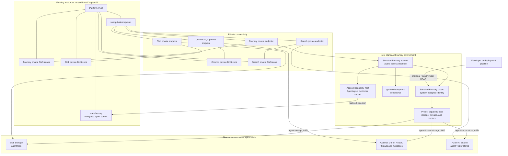

# Chapter 01a — Standard Agent Setup with Network Injection

This folder upgrades the Chapter 01 private Foundry account into a **Standard Agent Setup with
network injection**, so that **agent tool-call egress flows through your VNet** (`snet-foundry`).

## Why this exists

Chapter 01 makes the Foundry *control/data plane* private, but agents built on it still run their
tool-call egress on the Microsoft-managed network. Calling a VNet-only endpoint (for example an
internal APIM gateway) therefore fails with:

> The host name could not be resolved from the selected network path.

Foundry only injects agent compute into your delegated subnet when the account is a **Standard Agent
Setup** — bring-your-own **Cosmos DB + AI Search + Storage** wired through a **capability host** — and
the account carries a `networkInjections` block. This module provisions exactly that, reusing the
Chapter 01 VNet, subnets, and shared private DNS zones.

## Important constraint

Network injection **cannot be added to an account that already has agents**. This module therefore
stands up a **new** Standard account/project (names suffixed `-std`) alongside Chapter 01. Migrate by
rebuilding agents and tool connections on the Standard project, validate with `TEST.md`, then retire
the old account.

## What it deploys

Chapter 01a adds a new Standard Agent Setup beside the Basic Foundry environment from Chapter 01.
It reuses the Chapter 01 network and creates the resources required for customer-owned agent state,
private agent execution, and VNet-based tool egress.

### End state after Chapter 01a



The project capability host is the integration point for agent state. Foundry provisions and uses
its file, thread, message, and vector-store structures inside these customer-owned resources rather
than using a Microsoft-managed state store.

### Resources created by this module

| Resource | Bicep behavior | Role in the platform |
|---|---|---|
| Standard Foundry account | Creates a private `AIServices` account with local authentication disabled, default-deny network ACLs, and a system-assigned identity | Hosts the Standard Agent Setup separately from the original Basic account |
| Standard Foundry project | Creates a project with its own system-assigned managed identity | Owns agents, connections, and access to customer-owned state |
| `gpt-4o` deployment | Created by default when `deployModel=true`; model version and capacity are parameters | Chat model for agents created in the Standard project |
| Storage account | Creates Standard LRS Blob Storage with public access, shared-key access, and blob anonymous access disabled; HTTPS and TLS 1.2 are required | Stores agent files and other capability-host artifacts |
| Cosmos DB account | Creates a single-region Cosmos DB for NoSQL account with Session consistency, public access disabled, and local authentication disabled | Stores persistent agent threads and messages |
| Azure AI Search | Creates a Standard search service with one replica and partition, semantic ranker, system identity, public access disabled, and local authentication disabled | Stores and queries agent vector stores; it can also support the later Foundry IQ deployment |
| Foundry private endpoint | Connects the Standard Foundry account to `snet-privateendpoints` using the `account` private-link group | Provides private access to the Foundry account and project endpoints |
| Storage private endpoint | Connects the Blob service to `snet-privateendpoints` | Provides private file and artifact access |
| Cosmos DB private endpoint | Connects the Cosmos SQL endpoint to `snet-privateendpoints` | Provides private thread and message access |
| AI Search private endpoint | Connects the search service to `snet-privateendpoints` | Provides private vector-store access |
| Cosmos private DNS zone | Creates `privatelink.documents.azure.com` and links it to the platform VNet | Resolves Cosmos DB to its private endpoint |
| Search private DNS zone | Creates `privatelink.search.windows.net` and links it to the platform VNet | Resolves AI Search to its private endpoint |
| Foundry project connections | Creates `agent-storage`, `agent-thread-storage`, and `agent-vector-store`, all using `authType: AAD` | Supplies the capability host with keyless connections to Storage, Cosmos DB, and AI Search |
| Account capability host | Creates an `Agents` host associated with `snet-foundry` | Connects Foundry agent execution to the customer subnet |
| Project capability host | Binds the three project connections as storage, thread storage, and vector-store connections | Causes Foundry to provision and use agent state in the customer-owned services |
| Role assignments | Grants the project identity the service-specific roles listed below | Allows capability-host provisioning and runtime data access without account keys |
| Foundry User assignment | Created only when `foundryUserPrincipalId` is supplied | Allows the selected user, group, or service principal to build agents in the project |

### Existing Chapter 01 resources reused

This module references these resources as `existing`; it does not recreate them:

| Existing resource | How Chapter 01a uses it |
|---|---|
| Platform VNet | Network boundary for injected agent execution and private endpoints |
| `snet-foundry` | Customer subnet recorded by the account capability host and the account's `networkInjections` configuration |
| `snet-privateendpoints` | Hosts the four new private endpoints |
| `privatelink.cognitiveservices.azure.com` | Resolves the Foundry AI Services private endpoint |
| `privatelink.openai.azure.com` | Resolves the Azure OpenAI private endpoint |
| `privatelink.services.ai.azure.com` | Resolves the Foundry project private endpoint |
| Blob private DNS zone | Resolves the new Storage account's Blob private endpoint |

The optional `additionalLinkedVnetIds` parameter links additional administration or build VNets to
the new Cosmos DB and AI Search private DNS zones. This is required when a peered host must access
those private services; VNet peering alone does not provide private DNS resolution.

### Identity and role assignments

The Standard Foundry project's system-assigned identity receives:

| Target | Role | Why it is required |
|---|---|---|
| Storage account | Storage Blob Data Owner | Allows Foundry to provision and manage agent file storage |
| Cosmos DB account | Cosmos DB Operator | Allows management operations required by the capability host |
| Cosmos DB data plane | Cosmos DB Built-in Data Contributor | Allows thread and message reads and writes |
| Azure AI Search | Search Service Contributor | Allows Foundry to provision search resources |
| Azure AI Search | Search Index Data Contributor | Allows vector index document reads and writes |

All three Foundry project connections use Microsoft Entra authentication. Storage shared keys,
Cosmos DB keys, Search admin keys, and Foundry local keys are not used by this setup.

### Runtime behavior

1. Foundry runs hosted agent compute through the delegated `snet-foundry` subnet.
2. The project capability host uses Blob Storage for files, Cosmos DB for threads and messages, and
   AI Search for vector stores.
3. Private DNS resolves each service hostname to its private endpoint in
   `snet-privateendpoints`.
4. The project managed identity authenticates to each state service through Microsoft Entra ID.
5. Agent tool-call egress originates from the injected network path and can resolve and reach
   VNet-only services deployed in later chapters, such as internal APIM.

### Not created by this module

- Agents and their MCP or A2A tool connections are post-deployment data-plane resources.
- APIM, API Center, Foundry IQ indexes, observability, and Defender resources are introduced in later
  chapters.
- The original Basic Foundry account is not upgraded or removed; the new Standard account is
  deployed beside it for migration.
- A firewall, NAT gateway, route table, and Foundry-subnet NSG are not added here.

## Prerequisites

- Chapter 01 deployed (its VNet, subnets, and private DNS zones are reused)
- Azure CLI signed in to the blueprint tenant/subscription

## Deploy

Run from the repository root in PowerShell:

```powershell
# 1. Compile check (optional)
az bicep build --file .\infra\chapter-01a-standard-agent-network-injection\main.bicep

# 2. Preview only (no changes)
.\infra\chapter-01a-standard-agent-network-injection\deploy.ps1

# 3. Deploy
.\infra\chapter-01a-standard-agent-network-injection\deploy.ps1 -Execute
```

### Known deployment gotchas (full recovery steps in `TEST.md` Part 0)

- **AI Search capacity:** if the VNet region returns `InsufficientResourcesAvailable`, pass
  `searchLocation=<adjacent region>` (e.g. `eastus`). The VNet private endpoint reaches it cross-region.
- **Account capability host `customerSubnet`:** the account-level capability host must set
  `customerSubnet` to the injected subnet (already in `main.bicep`).
- **Capability hosts are not idempotent:** if a deploy half-completes, don't re-run the template —
  create only the missing **project** capability host via `az rest --method PUT` (see `TEST.md` §0.4).
- **Post-deploy manual steps:** deploy the gpt-4o model, pre-create the `WeatherMCP` connection with the
  Entra audience, create the agent in the portal, then grant the new agent identity `Mcp.Invoke`
  (`TEST.md` §0.6–0.8).

## Validate

Follow `TEST.md` in this folder. It validates network injection, the capability hosts, the private
dependencies, and includes the exact steps to configure MCP/A2A tool connections **without** the
`400 Failed to fetch agentic identity access token` error (correct connection audience).
